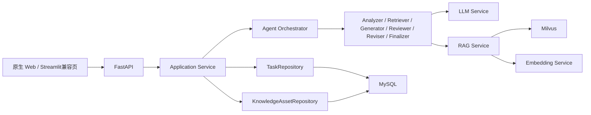

# AI 测试分析助手

面向测试工程师的 AI 测试分析项目：上传 PRD 后，由受控 Agentic Workflow 完成需求理解、历史测试资产检索、结构化测试点生成、质量评审与报告输出，并支持任务恢复、人工反馈和知识沉淀。

> 当前聚焦“测试分析报告生成”。自动化用例执行、缺陷定位和日志分析不属于当前已实现范围。

## 项目定位

这个项目不是让 LLM 自由规划和任意调用工具的自主 Agent，而是由 Python Orchestrator 控制节点顺序、暂停条件和最大修正次数的受控 Agentic Workflow。

```text
PRD文本或文档
  → 需求分析 RequirementAnalyzer
  → 历史资产检索 KnowledgeRetriever
  → 测试点生成 TestPointGenerator
  → 质量评审 Reviewer
  → 受控修正 Reviser（按需、最多2轮自动修正）
  → 报告整理 Finalizer
```

Human-in-the-loop 可在两个位置介入：

- 核心信息不足时，任务暂停并等待用户补充，随后恢复同一个 `task_id`；
- 报告完成后，用户可以选择提交测试建议或业务规则，生成修订版报告，也可以直接结束任务。

## 核心能力

- 支持文本、TXT、Markdown、PDF、DOCX 需求输入；
- 提取需求事实、业务规则、状态流转、推导风险和关键待确认项；
- 每轮最多展示3个真正影响测试预期的确认问题，非阻塞问题转为风险继续分析；
- 生成包含分类、优先级、前置条件、步骤、预期结果和来源依据的结构化测试点；
- Reviewer检查覆盖度、边界异常、重复项、可执行性、可追踪性和无依据断言；
- Reviser使用增量操作修正测试点，由Python校验后原子合并并重新评审；
- 生成可预览、可下载的Markdown测试分析报告；
- MySQL保存版本化任务快照、Agent事件和执行记录，服务重启后可恢复；
- 用户确认脱敏后，将完整知识资产保存到MySQL，并将有界检索片段写入Milvus；
- 历史任务支持搜索、恢复、重命名和删除；知识资产支持搜索、筛选、停用、恢复和索引重试；
- 记录节点耗时、LLM Token、重试次数、错误类型和Milvus检索耗时。

## 架构设计



依赖方向遵循以下边界：

- 页面只表达创建、继续、补充、确认、反馈等用户动作；
- Application Service负责加载任务、调用Orchestrator、保存结果并返回只读TaskView；
- Orchestrator根据AgentState决定下一节点，页面不能指定节点；
- Repository隔离内存和MySQL实现；
- LLM、Embedding、Milvus和文档解析均通过Service边界接入。

## 数据存储

| 存储 | 保存内容 | 作用 |
|---|---|---|
| MySQL任务表 | 完整AgentState JSON快照、状态、步骤、任务名、版本 | 任务恢复与历史查询 |
| MySQL事件/执行表 | Agent事件、execution_id、执行租约 | 审计与重复执行保护 |
| MySQL知识资产表 | 完整需求、测试点、评审和报告的版本化快照 | 权威知识内容 |
| Milvus | 有界短片段、向量、asset_id、版本和内容哈希 | 相似资产候选召回 |

Milvus负责“找到候选”，MySQL负责“返回完整且可审计的权威内容”。召回结果会通过关联标识回查MySQL，不把向量库当作文档数据库使用。

## 真实验收证据

阶段2.20.3使用真实PDF、LLM、MySQL和Milvus完成了一轮端到端验收：

```text
上传PDF → 解析 → 补充3个关键问题 → 恢复同一任务
→ 历史资产检索 → 生成测试点 → Reviewer评审 → 生成报告
→ 可选人工反馈 → 再次修正与评审 → 保存知识资产V1/V2
→ 重启后端 → 从MySQL恢复历史任务
```

该次样本首次生成10个测试点、Reviewer评分88分；提交一次人工反馈后生成12个测试点和新版报告。两版知识资产均完成Milvus索引。累计节点耗时97.18秒，其中LLM累计81.56秒、Milvus检索15.59秒。

这些数据只代表该样本、当前模型和网络环境下的一次实测，不是平均性能或通用质量结论。

默认自动化测试结果：

```text
570 passed, 10 skipped
```

跳过项是需要显式环境变量开启的真实MySQL和Tesseract集成测试。默认测试使用Fake/Mock，不调用真实LLM、Embedding或Milvus。

## 快速体验

### 1. 安装依赖

建议使用Python 3.10或更高版本。

```powershell
python -m venv .venv
.\.venv\Scripts\Activate.ps1
pip install -r requirements-dev.txt
Copy-Item .env.example .env
```

至少在 `.env` 中配置可用的LLM：

```text
DEEPSEEK_API_KEY=your_api_key
DEEPSEEK_BASE_URL=https://your-compatible-endpoint/v1
DEEPSEEK_MODEL=your_model
```

如需体验任务持久化和知识检索，再配置MySQL、Embedding和Milvus。完整配置项可参考 [.env.example](.env.example)。

### 2. 启动FastAPI与原生Web

```powershell
python -m uvicorn api.main:app --host 127.0.0.1 --port 8000
```

打开：

- 工作台：<http://127.0.0.1:8000/app/>
- 知识库：<http://127.0.0.1:8000/app/knowledge.html>
- Swagger：<http://127.0.0.1:8000/docs>

仓库内提供可公开演示的虚构样本：

- `evaluation/fixtures/assets/native_order_requirement.pdf`
- `evaluation/fixtures/assets/realistic_checkout_prd.docx`
- `evaluation/fixtures/assets/realistic_smart_lock_prd.docx`

### 3. 运行测试

```powershell
python -m pytest -q
python -m compileall -q agent application api documents knowledge_assets repositories services utils views tests main.py
git diff --check
```

## 项目结构

```text
api/                 FastAPI接口、进度Presenter和原生Web托管
application/         用户用例、Application Service、只读TaskView和任务快照
agent/               AgentState、Orchestrator、节点、事件和领域模型
documents/           PDF/DOCX/OCR/视觉元素的统一文档模型与解析
knowledge_assets/    知识资产、准入策略、版本化快照和有界Chunk
repositories/        Task/KnowledgeAsset Repository及内存、MySQL实现
services/            LLM、RAG、Embedding、Milvus和文档解析适配
frontend/            无框架原生Web工作台与知识库页面
views/               Streamlit兼容演示页面
evaluation/          脱敏需求、图文样本、离线评测脚本与结果
tests/               unit、architecture、app和integration分层测试
docs/                PRD、开发状态、路线图和学习复盘
```

## 项目边界与已知限制

- 后台任务使用进程内 `ThreadPoolExecutor`，适合单实例演示，不等同于Celery/Redis分布式队列；
- 前端采用轮询，不是SSE或Token级流式输出；
- OCR依赖本地Tesseract；视觉理解需要显式配置兼容的多模态端点；
- 真实图文语义效果仍需更多经过授权和脱敏的企业样本验证；
- 已有离线评测和少量真实集成证据，但不能声称对任意领域、任意长度PRD都稳定有效；
- 项目当前功能已冻结，暂不扩展多Agent自由协作、任意工具调用和不受控自主规划。

## 文档导航

- [当前产品PRD](docs/product/PRD_AGENT_V2.md)
- [当前开发状态](docs/CURRENT_STATUS.md)
- [完整开发日志](docs/DEVELOPMENT_LOG.md)
- [代码学习与面试复盘](docs/LEARNING_NOTES.md)
- [秋招项目路线图](docs/roadmap/AUTUMN_RECRUITMENT_ROADMAP.md)
- [Codex跨设备协作说明](AGENTS.md)

## 简历中的准确定位

推荐描述为：

> 基于FastAPI、受控Agentic Workflow、RAG与Human-in-the-loop构建AI测试分析助手，实现图文PRD解析、结构化测试点生成、Reviewer/Reviser质量闭环、MySQL任务恢复和Milvus历史测试资产沉淀。

不建议描述为“完全自主Agent”“多Agent协作平台”或“自动完成测试执行”，因为这些能力不在当前实现范围内。
